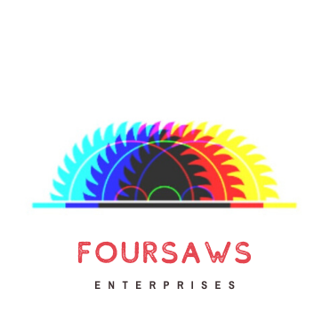

  **Hello, World!**   
  **Hello, Operator!**  

Data is messy. But it doesn't have to be. Introducing the system that presents your data in a way that will allow you to make interpretations in real-time. You don't need to search through your databases every day to monitor client behaviour. Instead, you can say hello to organised data. 
You can say hello to your new billing system...

<iframe width="420" height="315"
src="https://www.youtube.com/embed/ZOkvADbDS60">
</iframe>

 
  **Features:**  
 
- Monthly billing after standard rates specified
- Automatic report generation for clients
- Visual owner dashboard, with insightful analytics
- Graphing peak times that clients use your services
- Displaying which parts of your services the clients use the most
- Identifying risk clients to save your business from harm

  **Introducing dark mode!**  

As of May 2020, *Hello, Operator* now comes with the option to view each interface in either light or dark mode. 

 
  **Download instructions**  

At the moment,  *Hello, Operator*  is undergoing its first prototype. A beta version is planned to be releaased later in 2020, with a stable version following suite.

  **Ad meloria,**   
   **The FourSAWS Enterprises Team**  

